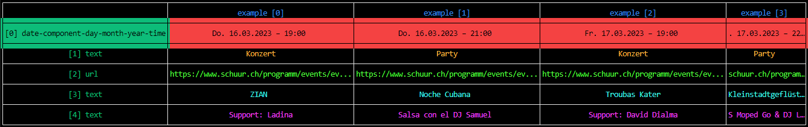

# goskyr

<div style="text-align:center"></div>

[](https://github.com/jakopako/goskyr/releases)
[](https://goreportcard.com/report/github.com/jakopako/goskyr)


1. [Quick Start](#quick-start)
1. [Installation](#installation)
1. [Semi-Automatic Configuration](#semi-automatic-configuration)
1. [Manual Configuration & Usage](#manual-configuration--usage)
   1. [Static fields](#static-fields)
   1. [Dynamic fields](#dynamic-fields)
   1. [JS rendering](#js-rendering)
   1. [Filters](#filters)
   1. [Interaction](#interaction)
   1. [Pagination](#pagination)
   1. [Output](#output)
1. [Build ML Model for Improved Auto-Config](#build-ml-model-for-improved-auto-config)
1. [Related Projects](#related-projects)
1. [Build & Release](#build--release)
1. [Contributing](#contributing)
1. [Naming](#naming)

This project's goal is to make it easier to **scrape structured data** from web pages.
This could be a list of books from an online book store, a list of plays in a public theater, a list of newspaper articles, etc. Currently, the biggest use-case that I know of is [croncert](https://github.com/jakopako/croncert-config) which is also the main motivation behind this project.

Since version 0.3.0 basic **js rendering** is supported. Additionally, next to [manually configuring](#manual-configuration--usage) the scraper there is an option of (semi-)automatically generating a configuration file, see [quick start](#quick-start) and [Semi-Automatic Configuration](#semi-automatic-configuration).

Since version 0.4.0 **machine learning** can be leveraged to predict field names more or less accurately. For more details check out the sections [Semi-Automatic Configuration](#semi-automatic-configuration) and [Build ML Model for Improved Auto-Config](#build-ml-model-for-improved-auto-config).

Note that there are already similar projects that might do a better job in certain cases or are more generic tools. However, on the one hand this is a personal project to make myself familiar with webscraping and Go and on the other hand goskyr supports certain features that I haven't found in any other projects. For instance, the way dates can be extracted from websites and the notion of scraping information from subpages defined by previously at runtime extracted urls.

Similar projects:

- [MontFerret/ferret](https://github.com/MontFerret/ferret)
- [slotix/dataflowkit](https://github.com/slotix/dataflowkit)
- [andrewstuart/goq](https://github.com/andrewstuart/goq)

## Quick Start

https://user-images.githubusercontent.com/26999089/210244250-09a11b64-0981-40d1-8f81-9fbb00e17164.mp4

To reproduce what happens above [install goskyr](#installation) and then run the following steps:

Start the configuration generation. The configuration file is written to the default location `config.yml`. Navigation in the interactive terminal window is done with the arrow keys, the return key and the tab key.

```bash
goskyr -g https://www.imdb.com/chart/top/ -f
```

Note, that different colors are used to show how 'close' certain fields are to each other in the html tree. This should help when there are multiple list-like structures on a web page and you need to figure out which fields belong together.

Next, start the scraping process. The configuration file is read from the default location `config.yml`.

```bash
goskyr
```

Optionally, modify the configuration file according to your needs. For more information check out the section on [manually configuring](#manual-configuration--usage) the scraper. For a better understanding of the command line flags run

```bash
goskyr -help
```

Note that the feature to (semi-)automatically generate a configuration file is currently in an experimental stage and might not properly work in a lot of cases.

## Installation

[Download](https://github.com/jakopako/goskyr/releases/latest) a prebuilt binary from the [releases page](https://github.com/jakopako/goskyr/releases), unpack and run!

Or if you have recent go compiler installed download goskyr by running

```bash
go install github.com/jakopako/goskyr@latest
```

Or clone the repository and then run with `go run main.go ...` or build it yourself.

## Semi-Automatic Configuration

As shown under [Quick Start](#quick-start) goskyr can be used to automatically extract a configuration for a given url. A number of different options are available.

- `-g`: Pass the url you want to extract data from to this flag.
- `-f`: Only show fields that have varying values across the list of items.
- `-m`: The minimum number of items on a page. This is needed to filter out noise. The default is 20.
- `-d`: Render JS before starting to extract the configuration.
- `--model`: This option is new since `v0.4.0`. You can pass a reference to a ML model that suggests names for the extracted fields. Note that the model currently consists of two files that have to be named exactly the same except for the ending. The string that you have to pass to the `--model` flag has to be the filename without the ending. Check out the section on [building a ML model](#build-ml-model-for-improved-auto-config).
- `-w`: Works in combination with `--model`. This flag is used to pass a the name of a directory that contains a bunch of text files with dictionary words. This is needed for feature extraction for the ML stuff. This repository contains an example of such a directory, `word-lists`, although the lists are pretty limited. Default is `word-lists`.

Note that when using machine learning & a properly trained model, the auto configuration is capable of determining what fields could be a date and what date components they contain. With that information another algorithm then tries to derive the format of the date that is needed for proper parsing. So in the best case you have to do nothing more than rename some of the fields to get the desired configuration.

Note that the machine learning feature is rather new and might not always work well, especially since it only takes into account a fields value and not its position in the DOM. A basic model is contained in the `ml-models` directory. It uses the labels `text`, `url` and `date-component-*`. You could for instance run `goskyr -g  https://www.schuur.ch/programm/ --model ml-models/knn-types-v0.4.4` which would suggest the following fields to you.



## Manual Configuration & Usage

Despite the option to automatically generate a configuration file for goskyr there are a lot more options that can be configured manually.

A very simple configuration would look something like this:

```yml
scrapers:
  - name: LifeQuotes # The name is only for logging and scraper selection (with -s) and does not appear in the json output.
    url: "https://www.goodreads.com/quotes/tag/life"
    item: ".quote"
    fields:
      - name: "quote"
        location:
          selector: ".quoteText"
      - name: "author"
        location:
          selector: ".authorOrTitle"
```

Save this to a file, e.g. `quotes-config.yml` and run `goskyr -c quotes-config.yml` (or `go run main.go -c quotes-config.yml`) to retreive the scraped quotes as json string. The result should look something like this:

```json
[
  {
    "author": "Marilyn Monroe",
    "quote": "“I'm selfish, impatient and a little insecure. I make mistakes, I am out of control and at times hard to handle. But if you can't handle me at my worst, then you sure as hell don't deserve me at my best.”"
  },
  {
    "author": "William W. Purkey",
    "quote": "“You've gotta dance like there's nobody watching,"
  },
  ...
]
```

A more complex configuration might look like this:

```yml
scrapers:
  - name: Kaufleuten
    url: "https://kaufleuten.ch/events/kultur/konzerte/"
    item: ".event"
    fields:
      - name: "location"
        value: "Kaufleuten"
      - name: "city"
        value: "Zurich"
      - name: "type"
        value: "concert"
      - name: "title"
        location:
          selector: "h3"
          regex_extract:
            exp: "[^•]*"
            index: 0
      - name: "comment"
        can_be_empty: true
        location:
          selector: ".subtitle strong"
      - name: "url"
        type: "url"
        location:
          selector: ".event-link"
      - name: "date"
        type: "date"
        on_subpage: "url"
        components:
          - covers:
              day: true
              month: true
              year: true
              time: true
            location:
              selector: ".event-meta time"
              attr: "datetime"
            layout: ["2006-01-02T15:04:05-07:00"]
        date_location: "Europe/Berlin"
    filters:
      - field: "title"
        exp: "Verschoben.*"
        match: false
      - field: "title"
        exp: "Abgesagt.*"
        match: false
```

The result should look something like this:

```json
[
  {
    "city": "Zurich",
    "comment": "Der Schweizer Singer-Songwriter, mit Gitarre und bekannten sowie neuen Songs",
    "date": "2022-03-09T19:00:00+01:00",
    "location": "Kaufleuten",
    "title": "Bastian Baker",
    "type": "concert",
    "url": "https://kaufleuten.ch/event/bastian-baker/"
  },
  {
    "city": "Zurich",
    "comment": "Der kanadische Elektro-Star meldet sich mit neuem Album zurück",
    "date": "2022-03-13T19:00:00+01:00",
    "location": "Kaufleuten",
    "title": "Caribou",
    "type": "concert",
    "url": "https://kaufleuten.ch/event/caribou/"
  },
  ...
]
```

Basically, a config file contains a list of scrapers that each may have static and / or dynamic fields. Additionally, items can be filtered based on regular expressions and pagination is also supported. The resulting array of items is written to stdout or a file, as json string.

### Static fields

Each scraper can define a number of static fields. Those fields are the same over all returned items. For the event scraping use case this might be the location name as shown in the example above. For a static field only a name and a value need to be defined:

```yml
fields:
  - name: "location"
    value: "Kaufleuten"
```

### Dynamic fields

Dynamic fields are a little more complex as their values are extracted from the webpage and can have different types. In the most trivial case it suffices to define a field name and a selector so the scraper knows where to look for the corresponding value. The quotes scraper is a good example for that:

```yml
fields:
  - name: "quote"
    type: "text" # defaults to 'text' if ommited
    location:
      selector: ".quoteText"
```

A dynamic field can have one of the following three types: `text`, `url` or `date`. The following table shows which options are available for which type.

| Option        | Type `text` | Type `url` | Type `date` | Default value |
| ------------- | :---------: | :--------: | :---------: | ------------- |
| can_be_empty  |      X      |     X      |             | `false`       |
| components    |             |            |      X      | `[]`          |
| date_language |             |            |      X      | `"de_DE"`     |
| date_location |             |            |      X      | `"UTC"`       |
| guess_year    |             |            |      X      | `false`       |
| hide          |      X      |     X      |      X      | `false`       |
| location      |      X      |     X      |             | `[]`          |
| name          |      X      |     X      |      X      | `""`          |
| on_subpage    |      X      |     X      |      X      | `""`          |
| separator     |      X      |            |             | `""`          |
| type          |      X      |     X      |      X      | `"text"`      |

#### Options explained

**`can_be_empty`**

If set to `false`, an error message will be printed for each item where this field is missing (i.e. the html node does not exist or the corresponding string is empty) and the correspondig item will not be included in the resulting list of items. If set to `true` there won't be an error message and the corresponding value will be an empty string.

**`components`**

This key contains the configuration for the different date components that are needed to extract a valid date. A list of the following form needs to be defined.

```yml
components:
  - covers: # what part of the date is covered by the element located at 'location'?
      day: bool # optional
      month: bool # optional
      year: bool # optional
      time: bool # optional
    location: # the location has the same configuration as explained under option 'location' with the exception that it is not a list but just a single location configuration.
      selector: "<selector>"
      ...
    layout: ["<layout>"] # a list of layouts that apply to this date component. Needs to be configured the "golang-way" and always in English.
  - covers:
      ...
```

The following example should give you a better idea how such the definition of `components` might actually look like.

```yml
components:
  - covers:
      day: true
    location:
      selector: ".commingupEventsList_block2"
    layout: ["02. "]
  - covers:
      month: true
    location:
      selector: ".commingupEventsList_block3"
    layout: ["January"]
  - covers:
      time: true
    location:
      selector: ".commingupEventsList_block4"
    layout: ["15Uhr04"]
```

For more details about the layout check out [this link](https://yourbasic.org/golang/format-parse-string-time-date-example/) or have a look at the numerous examples in the `concerts-config.yml`. Also note that mostly the layout list only contains one element. Only in rare cases where different events on the same site have different layouts it is necessary to define more than one layout.

**`date_language`**

The `date_language` needs to correspond to the language on the website. Note, that this doesn't matter for dates that only contain numbers. The values that are supported are the ones supported by the underlying library, [goodsign/monday](https://github.com/goodsign/monday).

**`date_location`**

`date_location` sets the time zone of the respective date.

**`guess_year`**

If set to `false` and no date component is defined that covers the year, the year of the resulting date defaults to the current year. If set to `true` and no date component is defined that covers the year, goskyr will try to be 'smart' in guessing the year. This helps if a scraped list of dates covers more than one year and/or scraped dates are not within the current year but the next. Note that there are definitely more cases where this year guessing does not yet work.

**`hide`**

This option determines whether a field should be exlcuded from the resulting items. This can be handy when you want to filter based on a field that you don't want to include in the actual items. For more information on filters checkout the [Filters](#filters) section below.

**`location`**

There are two options on how to use the `location` key. Either you define a bunch of subkeys directly under `location` or you define a list of items each containing those subkeys. The latter is useful if you want the value of a field to be juxtaposition of multiple nodes in the html tree. The `separator` option will be used to join the strings. A very simple (imaginary) example could look something like this.

```yaml
fields:
  - name: artist
    location:
      - selector: div.artist
      - selector: div.country
    separator: ", "
```

The result may look like this.

```json
[...
{"artist": "Jacob Collier, UK"},
...]
```

_Subkey: `regex_extract`_

In some cases, it might be a bit more complex to extract the desired information. Take for instance the concert scraper configuration for "Kaufleuten", shown above, more specifically the config snippet for the `title` field.

```yml
fields:
  - name: "title"
    location:
      selector: "h3"
      regex_extract:
        exp: "[^•]*"
        index: 0
```

This field is implicitly of type `text`. The `location` tells the scraper where to look for the field value and how to extract it. In this case the selector on its own would not be enough to extract the desired value as we would get something like this: `Bastian Baker • Konzert`. That's why there is an extra option to define a regular expression to extract a substring. Note that in this example our extracted string would still contain a trailing space which is automatically removed by the scraper. Let's have a look at a few more examples to have a better understanding of the location configuration.

_Subkey: `node_index`_

Let's say we want to extract "Tonhalle-Orchester Zürich" from the following html snippet.

```html
<div class="member">
  <span class="member-name"></span>
  <span class="member-name"> Tonhalle-Orchester Zürich</span
  ><span class="member-function">, </span>
  <span class="member-name"> Yi-Chen Lin</span
  ><span class="member-function"> Leitung und Konzept,</span>
  <span class="composer"> Der Feuervogel </span>
  <span class="veranstalter"> Organizer: Tonhalle-Gesellschaft Zürich AG </span>
</div>
```

We can do this by configuring the location like this:

```yml
location:
  selector: ".member .member-name"
  node_index: 1 # This indicates that we want the second node (indexing starts at 0)
```

Note that the same result can be achieved with the `:nth-child()` selector so `node_index` might be removed in the future, see issue [#119](https://github.com/jakopako/goskyr/issues/119)

_Subkey: `child_index`_

Next, let's say we want to extract the time "20h00" from the following html snippet.

```html
<div class="col-sm-8 col-xs-12">
  <h3>Freitag, 25. Feb 2022</h3>

  <h2>
    <a href="/events/924"
      ><strong>Jacob Lee (AUS) - Verschoben</strong>
      <!--(USA)-->
    </a>
  </h2>
  <q>Singer & Songwriter</q>

  <p><strong>+ Support</strong></p>
  <i
    ><strong>Doors</strong> : 19h00 /
    <strong>Show</strong>
    : 20h00
  </i>
</div>
```

This can be achieved with the following configuration:

```yml
location:
  selector: ".col-sm-8 i"
  child_index: 3
  regex_extract:
    exp: "[0-9]{2}h[0-9]{2}"
```

Here, the selector is not enough to extract the desired string and we can't go further down the tree by using different selectors. With the `child_index` we can point to the exact string we want. A `child_index` of 0 would point to the first `<strong>` node, a `child_index` of 1 would point to the string containing "19h00", a `child_index` of 2 would point to the second `<strong>` node and finally a `child_index` of 3 points to the correct string. If `child_index` is set to -1 the first child that results in a regex match will be used. This can be useful if the `child_index` varies across different items. In the current example however, the `child_index` is always the same but the string still contains more stuff than we need which is why we use a regular expression to extract the desired substring.

_Subkey: `entire_subtree`_

This subkey, if set to `true` causes goskyr to grab all text elements under the element defined in the location's selector. It is useful when the target location contains inline tags, eg. `This is some text with a <strong>strong</strong> part.`

_Subkey: `all_nodes`_

This subkey, if set to `true` joins together all strings having the given selector. The subkey `separator` will be used as separator string. If not defined the separator is an empty string. Example:

```html
<div class="header">
  <h3 class="artist"><span class="name">Anja Schneider</span><span class="artist-info"></h3>
  <h3 class="artist"><span class="name">Steve Bug</span><span class="artist-info"></h3>
  <h3 class="artist"><span class="name">Dirty Flav</span><span class="artist-info">&nbsp;(WAD, D! Club - CH)</h3>
</div>
```

Config:

```yaml
fields:
  - name: title
    location:
      selector: .artist .name
      all_nodes: true
      separator: ", "
```

Resulting json:

```json
[...
{"title": "Anja Schneider, Steve Bug, Dirty Flav"},
...]
```

To get an even better feeling for the location configuration check out the numerous examples in the `concerts-config.yml` file.

_Subkey: `json_selector`_

If the string extracted from the webpage is a json string, then you can extract data from that json based on the give `json_selector`.

**`name`**

The name of the respective field.

**`on_subpage`**

If set to the name of another scraped field of type `url`, goskyr will fetch the corresponding page and extract the desired data from that page.

**`separator`**

This option is only relevant if the `location` option contains a list of locations of length > 1. If it does, the extracted strings (1 per location) will be joined using the defined separator.

**`type`**

This is the type of the field. As mentioned above its value can be `text`, `url` or `date`.

For a field of type `text` the value that is being extracted from the webpage based on the defined location will simply be assigned to the value of the corresponding field in the output.

If a field has type `url`, the resulting value in the output will allways be a full, valid url, meaning that it will contain protocol, hostname, path and query parameters. If the webpage does not provide this, goskyr will 'autocomplete' the url like a browser would. E.g. if a webpage, `https://event-venue.com`, contains `<a href="/events/10-03-2023-krachstock-final-story" >` and we would have a field of type `url` that extracts this url from the href attribute the resulting value would be `https://event-venue.com/events/10-03-2023-krachstock-final-story`. Also, the `location.attr` field is implicetly set to `"href"` if not defined by the user.

A `date` field is different from a text field in that the result is a complete, valid date. Internally, this is a `time.Time` object but in the json output it is represented by a string in RFCXXXX format. In order to be able to handle a lot of different cases where date information might be spread across different locations, might be formatted in different ways using different languages a date field has a list of components and some other optional settings, see table above.

As can be seen, a component has to define which part of the date it covers (at least one part has to be covered). Next, the location of this component has to be defined. This is done the same way as we defined the location for a text field string. Finally, we need to define a list of possible layouts where each layout is defined the 'go-way' as this scraper is written in go. For more details check out [this](https://yourbasic.org/golang/format-parse-string-time-date-example/) link or have a look at the numerous examples in the `concerts-config.yml` file. Note that a layout string is always in English although the date string on the scraped website might be in a different language. Also note that mostly the layout list only contains one element. Only in rare cases where different events on the same site have different layouts it is necessary to define more than one layout.

The `date_language` key needs to correspond to the language on the website. Currently, the default is `de_DE`. Note, that this doesn't matter for dates that only contain numbers. `date_location` sets the time zone of the respective date.

### JS rendering

Since version 0.3.0 js rendering is supported. For this to work the `google-chrome` binary needs to be installed. In the configuration snippet of a scraper just add `render_js: true` and everything will be taken care of. With `page_load_wait: <milliseconds>` the default waiting time of 2000 ms can be adapted accordingly.

User interactions with the page (eg scrolling) might be implemented in the future. Clicking has been implemented, see below section [Interaction](#interaction).

### Filters

Filters can be used to define what items should make it into the resulting list of items. A filter configuration can look as follows:

```yml
filters:
  - field: "status"
    exp: "cancelled"
    match: false
  - field: "status"
    exp: ".*(?i)(delayed).*"
    match: false
  - field: "date"
    exp: "> now" # format: <|> now|YYYY-MM-ddTHH:mm
    match: true
```

The `field` key determines to which field the expression will be applied. `exp` defines the expression and `match` determines whether the item should be included or excluded on match. Note, that as soon as there is one match for an expression that has `match` set to **false** the respective item will be excluded from the results without looking at the other filters.

The expression `exp` can be either a regular expression or a date comparison. Depending on the type of the respective `field` in the `fields` section of the configuration it has to be either one or the other. If the corresponding field is of type `date` the expression has to be a date comparison. For every other field type it has to be a regular expression.

### Interaction

If a dynamic webpage does initially not load all the items it might be necessary to click some kind of 'load more' button. This can be configured as follows:

```yml
interaction:
  type: click # for now only click is supported.
  selector: .some > div.selector
  count: 1 # number of clicks. Default is 1
  delay: 2000 # milliseconds that the scraper waits after each click. Default is 1000
```

Note that these clicks are executed before the data is scraped. Also the interaction configuration will be ignored if `render_js` is not set to `true` because only in that case is the website actually run within a headless browser.

### Pagination

If the list of items on a web page spans multiple pages pagination can be configured as follows:

```yml
paginator:
  location:
    selector: ".pagination .selector"
```

In case `render_js` is set to `false` by default the value of the `href` key is taken as url for the next page. However, you can change this and other parameters in the paginator configuration.

```yml
paginator:
  location:
    selector: ".pagination .selector"
    node_index: <number>
    attr: <string>
  max_pages: <number>
```

If `render_js` is set to `true` the scraper will simulate a mouse click on the given selector to loop over the pages.

### Output

Currently, the scraped data can either be written to stdout or to a file. If you don't explicitely configure the output in the configuration file the data is written to stdout. Otherwise you have to add the following snippet to your configuration file.

```yaml
writer:
  type: file
  filepath: test-file.json
```

## Build ML Model for Improved Auto-Config

In order for the auto configuration feature to find suitable names for the extracted fields, since `v0.4.0` machine learning can be used. Goskyr allows you to extract a fixed set of features based on an existing goskyr configuration. Basically, goskyr scrapes all the websites you configured, extracts the raw text values based on the configured fields per site and then calculates the features for each extracted value, labeling the resulting vector with the field name you defined in the configuration. Currently, all features are based on the extracted text only, ie not on the location within the website. Checkout the `Features` struct in the `ml/ml.go` file if you want to know what exactly those features are. Extraction command:

```bash
goskyr -e features.csv -w word-lists -c some-goskyr-config.yml
```

Note that `-w` and `-c` are optional. The respective defaults are `word-lists` and `config.yml`. The resulting csv file can optionally be edited (eg if you want to remove or replace some labels) and consequently be used to build a ML model, like so:

```bash
goskyr -t features.csv
```

Currently, a KNN classifier is used. The output of the above command shows the result of the training. Additionally, two files are generated, `goskyr.model` and `goskyr.class`. Both together define the model that can be used for labeling fields during auto configuration, see [Semi-Automatic Configuration](#semi-automatic-configuration).

Note that the classification will probably get better the more data you have to extract your features from. Also there might very well be cases where even a huge number of training data doesn't improve the classification results. This entire ML feature is rather experimental for now and time will tell how well it works and what needs to be improved or changed.

A real life example can be found in the [jakopako/croncert-config](https://github.com/jakopako/croncert-config) repository.

## Related Projects

The main motivation to start this project was a website idea that I wanted to implement. Currently, there are four
repositories involved in this idea. The first one is of course this one, goskyr. The other three are:

- [croncert-web](https://github.com/jakopako/croncert-web): a website that shows concerts in your area, deployed to [croncert.ch](https://croncert.ch).
- [croncert-config](https://github.com/jakopako/croncert-config): a repository that contains a big configuration file for
  goskyr, where all the concert venue websites that are part of [croncert.ch](https://croncert.ch) are configured. If you're interested, check out this repository to find out how to add new concert locations and to make yourself more familiar with how to use goskyr.
- [event-api](https://github.com/jakopako/event-api): an API to store and fetch concert info, that serves as backend for
  [croncert.ch](https://croncert.ch).

## Build & Release

To build and release a new version of goskyr [Goreleaser](https://goreleaser.com/) is used, also see [Quick Start](https://goreleaser.com/quick-start/).

1. Make a "dry-run" release to see if it works using the release command:

```bash
make release-dry-run
```

1. Make sure you have a file called `.release-env` containing the github token.

```bash
GITHUB_TOKEN=YOUR_GH_TOKEN
```

1. Create a tag and push it to GitHub

```bash
git tag -a v0.1.5 -m "new features"
git push origin v0.1.5
```

1. Run GoReleaser at the root of this repository:

```bash
make release
```

## Contributing

Feel free to contribute in any way you want! Help is always welcome.

## Naming

Go Scraper > Go Scr > Go Skyr > goskyr
